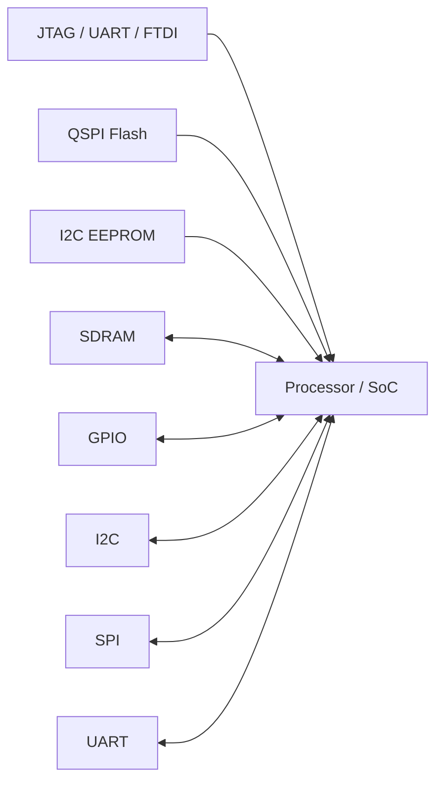
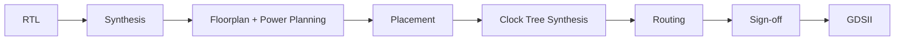
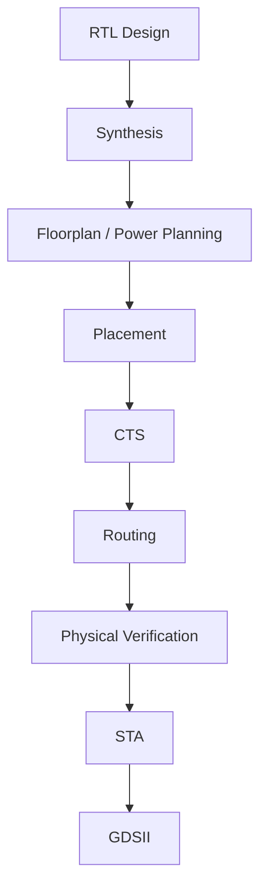

# Sky130 Module 1 — Open-Source EDA, OpenLANE & Sky130 PDK

> **Module:** Introduction to Open-Source EDA, OpenLANE and Sky130 PDK  
> **Topic:** From software/RTL to a fabricated ASIC — RTL-to-GDSII flow

---

## 1. Introduction to Open-Source EDA

This module introduces the basic concepts required to understand an ASIC design flow using open-source EDA tools.

### Main topics

- Open-source EDA
- OpenLANE ASIC flow
- SkyWater 130 nm (Sky130) PDK
- QFN-48 package
- Chip, die, core and pads
- IPs and macros
- SoC architecture
- RISC-V and ISA
- RTL design
- Synthesis
- Floorplanning and power planning
- Placement
- Clock Tree Synthesis (CTS)
- Routing
- Sign-off
- Design-for-Test (DFT)
- Logic Equivalence Checking (LEC)
- Static Timing Analysis (STA)
- Design Rule Checking (DRC)
- Layout Versus Schematic (LVS)

---

# 2. How Does Software Talk to Hardware?

There is an abstraction between a high-level programming language and physical hardware.

```text
C / C++ / Java
      |
      v
   Compiler
      |
      v
Assembly Language
      |
      v
   Assembler
      |
      v
Machine Code / Binary
      |
      v
   Processor
      |
      v
   Hardware
```

The processor understands **machine instructions**, not directly the high-level C/C++/Java source code.

---

# 3. RISC-V Introduction

## RISC-V Instruction Set Architecture (ISA)

**ISA** is the interface between software and the processor hardware.

It defines:

- Instructions
- Registers
- Data types
- Memory operations
- Instruction formats
- Programmer-visible behavior

Example instruction:

```text
add x6, x1, x0
```

The instruction is represented internally as binary machine code.

### Basic abstraction

```text
Instruction
    |
    v
Assembler
    |
    v
Machine Code
    |
    v
Processor / CPU
    |
    v
Digital Hardware
```

### ISA vs Implementation

- **ISA:** Defines *what* the processor does.
- **Microarchitecture/implementation:** Defines *how* the processor performs it.
- **Physical implementation:** Converts the hardware description/netlist into an actual chip layout.

---

# 4. From RTL to Hardware

An RTL description represents the digital hardware that implements the required functionality.

```text
Instruction Set Architecture
            |
            v
       RTL Design
            |
            v
   Synthesized Netlist
            |
            v
 Physical Design / P&R
            |
            v
        GDSII
            |
            v
       Fabrication
```

Example concept:

```verilog
module example (
    input  a,
    input  b,
    output y
);

assign y = a & b;

endmodule
```

The RTL is synthesized into a network of standard cells and later converted into physical geometry.

---

# 5. SoC, Chip, Die, Core and Pads

## Important terms

### Chip

The complete integrated circuit.

### Die

The physical piece of semiconductor containing the circuit.

### Core

The main internal region containing the implemented logic.

### Pads

Pads provide electrical connections between the internal chip circuitry and the outside world.

### IP (Intellectual Property)

Reusable blocks used inside a chip/SoC.

Examples:

- Processor core
- SRAM
- ADC
- PLL
- SPI
- I2C
- GPIO
- UART

---

# 6. QFN-48 Package

A **QFN-48** is a package with **48 external terminals/pads**.

A package connects the silicon die to the external PCB.

Basic hierarchy:

```text
PCB
 |
 v
Package
 |
 v
Chip / Die
 |
 +-----------------------+
 |         Core          |
 |                       |
 |   Digital / Analog    |
 |        Logic          |
 |                       |
 +-----------------------+
       |           |
      Pads        Pads
```


### Important physical terms

```text
Package
   |
   +-- Chip / Die
          |
          +-- Core
          |
          +-- Pads
          |
          +-- I/O
```

The pads carry signals between the chip and the outside environment.

---


# 7. Example SoC Interface Diagram

A processor/SoC can communicate with external memories and peripherals through different interfaces.



Typical interfaces mentioned in the notes include:

- JTAG
- UART
- FTDI
- QSPI
- I2C
- GPIO
- SDRAM
- SPI

---

# 8. Digital Core and External Pads

The **core** contains the main digital logic.

Signals entering or leaving the chip pass through I/O pads.

```text
             External World
                  |
            +-----+-----+
            |   PADS    |
            +-----+-----+
                  |
        +---------+---------+
        |       CORE        |
        |                   |
        | Processor / SoC   |
        | Digital Logic     |
        | SRAM / IPs        |
        +-------------------+
```

The boundary between the internal core and the external environment is handled through the pad ring/I/O circuitry.

---

# 9. IP Blocks

The notes identify several important IP blocks/components:

- RISC-V SoC / processor
- SRAM
- ADC
- PLL
- SPI
- I2C
- GPIO
- UART

These blocks may be integrated together to form a complete SoC.

---

# 10. Foundry IP / Macros

Some blocks are provided as reusable IP/macros rather than being designed from scratch every time.

Examples include:

- SRAM macros
- Analog blocks
- PLLs
- ADCs
- I/O libraries
- Standard-cell libraries

These blocks need to be compatible with the selected fabrication technology and PDK.

---

# 11. PDK — Process Design Kit

## What is a PDK?

**PDK = Process Design Kit**

A PDK is a collection of files and information required by EDA tools to design an IC for a particular fabrication process.

The PDK provides the technology information required to translate a logical design into a manufacturable physical layout.

### Typical PDK contents

- Process design rules
- Device models
- Standard-cell libraries
- Digital libraries
- I/O libraries
- Physical abstracts
- Timing information
- Technology files
- DRC rules
- LVS rules
- Extraction information
- Other files required by EDA tools

---

# 12. SkyWater 130 nm / Sky130 PDK

The notes focus on the **Sky130** open-source PDK for the SkyWater 130 nm process.

Open-source ASIC flows can use this PDK for:

- RTL-to-GDSII implementation
- Standard-cell based digital design
- Physical design
- DRC
- LVS
- Parasitic extraction
- Timing analysis

---

# 13. EDA Tools

EDA = **Electronic Design Automation**

EDA tools automate different stages of IC design.

Important tasks mentioned in the notes include:

- RTL synthesis
- Logic synthesis
- Floorplanning
- Power planning
- Placement
- Clock Tree Synthesis
- Routing
- DRC
- LVS
- DFM
- DFT
- Logic Equivalence Checking
- Static Timing Analysis
- Parasitic extraction
- Sign-off analysis

---

# 14. ASIC Flow Objective

The main objective of the ASIC flow is:

> **RTL → GDSII**

This is also called **automated Physical Design / Place-and-Route (PnR)**.

```text
RTL
 |
 v
Synthesis
 |
 v
Floorplan + Power Planning
 |
 v
Placement
 |
 v
Clock Tree Synthesis
 |
 v
Routing
 |
 v
Sign-off
 |
 v
GDSII
```

---

# 15. RTL-to-GDSII Flow



---


# 16. Synthesis

Synthesis converts RTL into a technology-dependent gate-level netlist.

```text
RTL
 |
 v
Logic Synthesis
 |
 v
Standard Cells
 |
 v
Gate-Level Netlist
```

The synthesizer maps the RTL functionality into available standard cells.

### Example

A logical operation such as:

```text
y = a AND b
```

can be mapped to an AND standard cell available in the selected standard-cell library.

---

# 17. Standard Cells

A standard-cell library contains pre-designed logic cells.

Examples:

- AND
- OR
- NAND
- NOR
- XOR
- Inverter
- Flip-flop
- Buffer
- Multiplexer

Each standard cell has:

- Logical function
- Physical layout
- Timing information
- Power information
- Area information

The physical design tools place and connect these cells.

---

# 18. Floorplanning

Floorplanning determines the overall physical organization of the design.

It includes:

- Die/core dimensions
- Core utilization
- Macro locations
- I/O/pad locations
- Power distribution planning
- Placement regions

A good floorplan helps reduce:

- Routing congestion
- Timing problems
- Area
- Power issues

---

# 19. Power Planning

Power planning creates the power-distribution network required to supply the cells and macros.

It deals with:

- VDD
- VSS / GND
- Power rings
- Power straps
- Power distribution
- Decoupling considerations

---

# 20. Placement

Placement determines where standard cells are physically located.

The notes divide placement into two stages:

### 1. Global Placement

Attempts to find an optimal approximate position for the cells.

### 2. Detailed Placement

Refines the positions obtained from global placement and legalizes the cells.

```text
Global Placement
       |
       v
Approximate / Optimized Positions
       |
       v
Detailed Placement
       |
       v
Legal Cell Locations
```

A good placement should:

- Minimize wirelength
- Reduce congestion
- Meet timing requirements
- Maintain legal cell locations

---

# 21. Clock Tree Synthesis (CTS)

## Definition

**Clock Tree Synthesis** creates a clock-distribution network that delivers the clock signal to sequential elements such as flip-flops.

### Objectives

- Deliver clock to all sequential elements
- Minimize clock skew
- Control insertion delay
- Maintain a good clock-tree structure
- Meet timing requirements

```text
                 Clock Source
                     |
                    CTS
                  /  |  \
                 /   |   \
                FF   FF   FF
               /           \
              FF            FF
```

### Clock Skew

Clock skew is the difference in clock arrival time between different sequential elements.

Ideally:

```text
Clock skew → minimum
```

Zero skew is difficult to achieve exactly in a real physical implementation.

---

# 22. Routing

Routing connects all placed cells using available metal layers.

### Important points

- Interconnects are implemented using metal layers.
- Metal tracks are generated using a routing grid.
- The routing grid can be very large.
- Routing is generally divided into global and detailed routing.

### Global Routing

Generates routing guides/routes at a higher level.

### Detailed Routing

Uses the routing guides to implement the actual physical wiring.

```text
Placed Cells
     |
     v
Global Routing
     |
     v
Routing Guides
     |
     v
Detailed Routing
     |
     v
Actual Metal Connections
```

---

# 23. Sign-off

Sign-off verifies whether the final physical design is ready for manufacturing.

## Physical Verification

### DRC — Design Rule Checking

Checks whether the layout follows the manufacturing/design rules.

### LVS — Layout Versus Schematic

Checks whether the extracted layout connectivity matches the intended schematic/netlist.

```text
Layout
  |
  v
Extraction
  |
  v
Compare with Netlist
  |
  v
LVS
```

## Timing Verification

### STA — Static Timing Analysis

Checks timing paths without requiring exhaustive simulation of every possible input pattern.

Important timing concepts:

- Setup time
- Hold time
- Clock period
- Clock skew
- Propagation delay
- Slack

---

# 24. Clean GDSII

A major goal of the OpenLANE flow is to produce a clean GDSII without requiring a human in the loop for every individual design.

### "Clean" means

- No LVS violations
- No DRC violations
- No unacceptable timing violations
- Successful physical verification
- A manufacturable layout

```text
             Clean GDSII
                  |
        +---------+---------+
        |         |         |
       DRC       LVS      Timing
        |         |         |
       PASS      PASS      PASS
```

---

# 25. OpenLANE

**OpenLANE** is an open-source RTL-to-GDSII ASIC implementation flow.

It integrates multiple open-source tools and automates many stages of digital ASIC physical design.

### Main idea

```text
RTL
 |
 v
OpenLANE
 |
 +--> Synthesis
 +--> Floorplanning
 +--> Placement
 +--> CTS
 +--> Routing
 +--> Sign-off
 |
 v
GDSII
```

OpenLANE can be used with the **Sky130 open PDK**.

---

# 26. Open-Source ASIC Flow

OpenLANE is part of an open-source ASIC ecosystem involving:

- Open PDKs
- Open-source EDA tools
- Open-source RTL
- Open-source physical design tools

The goal is to make the complete ASIC design flow more accessible and reproducible.

---

# 27. OpenLANE Design Flow



---

# 28. Design Space Exploration

**Design Space Exploration (DSE)** is used to search for good flow configurations.

The objective is to find a configuration that provides desirable:

- Area
- Timing
- Power
- Congestion
- Routing
- Manufacturability

```text
Many Flow Configurations
          |
          v
   Run Design Flow
          |
          v
 Compare Results
          |
          v
 Best Configuration
```

The notes mention a large number of design examples and known/best configurations, which can be used for exploration and regression testing.

---

# 29. Autonomous and Interactive Modes

OpenLANE can be used in different modes, including:

### Autonomous / Automated

The flow runs through predefined stages automatically.

### Interactive

The user can interact with the flow and inspect/control individual stages.

---

# 30. OpenLANE Regression Testing

Design exploration can also be useful for **regression testing**.

### Basic idea

```text
Known Design
     |
     v
Run OpenLANE
     |
     v
Compare Results
     |
     v
Known / Expected Results
```

This helps detect changes or failures in the flow.

---

# 31. Design for Test (DFT)

DFT makes an IC easier to test after manufacturing.

Important DFT concepts mentioned in the notes:

- Scan insertion
- Automatic Test Pattern Generation (ATPG)
- Test pattern compilation
- Fault coverage
- Fault simulation

### Scan Insertion

Adds scan structures such as scan flip-flops/chains so internal sequential elements can be tested.

### ATPG

**Automatic Test Pattern Generation** generates test patterns designed to detect faults.

### Fault Coverage

Measures how effectively the generated test patterns detect modeled faults.

---

# 32. Physical Implementation

Physical implementation is also called **Place and Route (PnR)**.

Main stages:

- Floorplanning
- Power planning
- Placement
- Post-placement optimization
- Clock Tree Synthesis
- Routing
- Physical verification

```text
Netlist
   |
   v
Floorplan / Power Plan
   |
   v
Placement
   |
   v
Post-Placement Optimization
   |
   v
CTS
   |
   v
Routing
   |
   v
Sign-off
```

---

# 33. Logic Equivalence Checking (LEC)

**LEC = Logic Equivalence Check**

LEC is used to formally confirm that two representations of a design have the same intended functionality.

For example:

```text
RTL
 |
 |  Synthesis / Optimization
 v
Gate-Level Netlist
 |
 v
LEC
 |
 v
Confirm functional equivalence
```

LEC helps confirm that the design function did not change after synthesis or optimization.

---

# 34. Antenna Effect

During fabrication, long metal interconnects can accumulate charge and potentially damage sensitive transistor structures.

This is known as the **antenna effect**.

### Antenna diode

Antenna diodes can be used as a protection mechanism to provide a path for accumulated charge and reduce antenna-related manufacturing problems.

Concept:

```text
Metal Wire
    |
    +------ Gate
    |
Antenna Diode
    |
   Substrate / Supply path
```

Antenna checking is therefore an important part of physical verification.

---

# 35. Timing Analysis

Timing analysis checks whether signals can propagate through the design within the required clock constraints.

### STA

**Static Timing Analysis (STA)** evaluates timing paths and checks setup/hold requirements.

Typical timing data includes:

- Liberty (`.lib`) timing information
- Parasitic data
- SPEF
- SDC constraints
- Netlist

The notes also mention **OpenSTA** as an open-source static timing analysis tool.

---

# 36. Parasitic Extraction

After routing, physical interconnects introduce parasitic:

- Resistance
- Capacitance

These affect delay and signal integrity.

Parasitic extraction generates data that can be used by timing analysis.

```text
Layout / Routed Design
          |
          v
Parasitic Extraction
          |
          v
RC Information
          |
          v
STA
```

---

# 37. DRC, LVS and PEX

### DRC

Checks physical layout against design rules.

### LVS

Checks whether layout connectivity matches the intended circuit/netlist.

### PEX

**Parasitic Extraction** extracts resistance and capacitance from the physical layout.

```text
Physical Layout
      |
      +----> DRC
      |
      +----> LVS
      |
      +----> PEX
              |
              v
             STA
```

---

# 38. Important Open-Source ASIC Concepts

| Concept | Meaning |
|---|---|
| EDA | Electronic Design Automation |
| ASIC | Application-Specific Integrated Circuit |
| RTL | Register Transfer Level |
| ISA | Instruction Set Architecture |
| PDK | Process Design Kit |
| IP | Intellectual Property |
| SoC | System-on-Chip |
| DSE | Design Space Exploration |
| PnR | Place and Route |
| CTS | Clock Tree Synthesis |
| DRC | Design Rule Checking |
| LVS | Layout Versus Schematic |
| PEX | Parasitic Extraction |
| STA | Static Timing Analysis |
| DFT | Design for Test |
| ATPG | Automatic Test Pattern Generation |
| LEC | Logic Equivalence Checking |
| GDSII | Final IC layout database format |

---

# 39. OpenLANE / Sky130 Design Examples

The notes list several example SoCs/designs and their features:

| Design | Feature |
|---|---|
| **strive** | Sky130 SCL + synthesized 1-byte SRAM |
| **strive2** | Sky130 SCL + 1 Kbyte OpenRAM block |
| **strive2a** | Strive2 with a single-chip core module |
| **strive3** | OSU SCL + synthesized 1 Kbyte SRAM |
| **strive5** | Sky130 SCL + 8 × 1 Kbyte OpenRAM bank |
| **strive6** | Strive2 with DFT |

> The names/features above are transcribed from the handwritten notes and organized for readability.

---

# 40. OpenLANE Flow Goal

The notes summarize the goal as:

> **Produce a clean GDSII with no human in the loop.**

A clean result should satisfy:

```text
DRC       → PASS
LVS       → PASS
Timing    → PASS / within required constraints
Routing   → Valid
Antenna   → Clean / handled
```

---

# 41. OpenLANE Features Mentioned

                     |
                     v
              +-------------+
              |  SYNTHESIS  |
              +-------------+
                     |
                     v
          +---------------------+
          | FLOORPLAN + POWER   |
          |       PLANNING      |
          +---------------------+
                     |
                     v
              +------------+
              | PLACEMENT  |
              +------------+
                     |
                     v
                 +-------+
                 |  CTS  |
                 +-------+
                     |
                     v
              +------------+
              |  ROUTING   |
              +------------+
                     |
                     v
            +----------------+
            |   SIGN-OFF     |
            | DRC / LVS /    |
            | PEX / STA      |
            +----------------+
                     |
                     v
                  GDSII
                     |
                     v
                FABRICATION
## 43. Key Takeaways

- **EDA Tools:** Automate electronic and IC design.
- **RISC-V ISA:** Provides an abstraction/interface between software and processor hardware.
- **RTL:** Describes digital hardware behavior at the register-transfer level.
- **Synthesis:** Converts RTL into a gate-level netlist using standard cells.
- **Floorplanning:** Defines the physical organization of the chip.
- **Placement:** Determines the physical locations of cells.
- **CTS:** Creates the clock distribution network.
- **Routing:** Creates physical metal interconnects.
- **DRC:** Checks manufacturing and design rules.
- **LVS:** Checks layout-to-netlist correspondence.
- **PEX:** Extracts parasitic resistance and capacitance.
- **STA:** Verifies timing.
- **DFT/ATPG:** Improves testability and fault detection.
- **LEC:** Verifies functional equivalence between different design representations.
- **PDK:** Contains the technology-specific files required by EDA tools.
- **OpenLANE:** Automates the open-source RTL-to-GDSII ASIC flow.
- **Sky130:** Provides an open 130 nm process design environment.
- **GDSII:** Represents the final physical design database used in the IC design/manufacturing flow.

---

## 44. One-Line Flow to Remember

### Complete RTL-to-GDSII Flow

```text
C/C++ → ISA → RTL → Synthesis → Floorplan → Placement → CTS → Routing → Sign-off → GDSII → Fabrication
